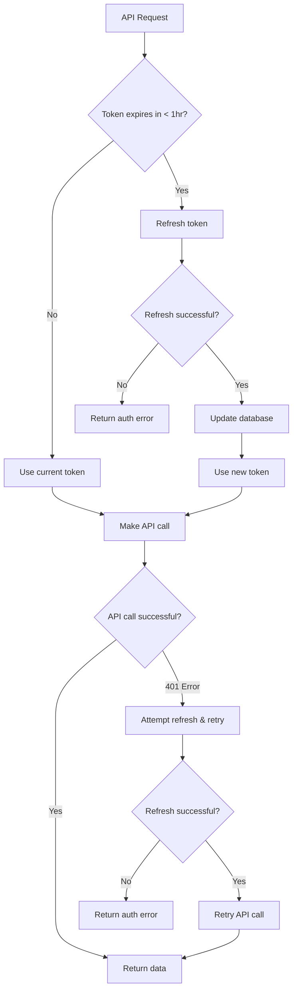

# 3800km - Hiking Progress Tracker

A beautiful Next.js application that tracks your hiking progress towards a 3,800km goal using the Strava API.

## Features

- 🚀 **Strava Integration**: Automatic activity sync from your Strava account
- 📊 **Progress Visualization**: Interactive charts showing your cumulative distance
- 🥾 **Activity Filtering**: Focuses on hiking, walking, and trail running activities
- 📱 **Responsive Design**: Beautiful, modern UI that works on all devices
- 🎯 **Goal Tracking**: Visual progress towards the 3,800km milestone

## Tech Stack

- **Framework**: Next.js 14 with TypeScript
- **Styling**: Tailwind CSS
- **Database**: Supabase
- **Charts**: Recharts
- **Icons**: Lucide React
- **Authentication**: Strava OAuth

## Setup Instructions

### 1. Clone and Install

```bash
git clone <your-repo>
cd 3800km
npm install
```

### 2. Set up Supabase

1. Create a new project at [supabase.com](https://supabase.com)
2. Copy your project URL and anon key
3. Create the following tables in your Supabase SQL editor:

```sql
-- Users table
CREATE TABLE users (
  id TEXT PRIMARY KEY,
  strava_id TEXT UNIQUE NOT NULL,
  access_token TEXT NOT NULL,
  refresh_token TEXT NOT NULL,
  expires_at BIGINT NOT NULL,
  created_at TIMESTAMP WITH TIME ZONE DEFAULT NOW(),
  updated_at TIMESTAMP WITH TIME ZONE DEFAULT NOW()
);

-- Activities table
CREATE TABLE activities (
  id SERIAL PRIMARY KEY,
  strava_id TEXT UNIQUE NOT NULL,
  name TEXT NOT NULL,
  type TEXT NOT NULL,
  distance REAL NOT NULL,
  moving_time INTEGER NOT NULL,
  start_date TIMESTAMP WITH TIME ZONE NOT NULL,
  location_city TEXT,
  location_country TEXT,
  elevation_gain REAL NOT NULL,
  user_id TEXT NOT NULL REFERENCES users(id),
  created_at TIMESTAMP WITH TIME ZONE DEFAULT NOW(),
  updated_at TIMESTAMP WITH TIME ZONE DEFAULT NOW()
);

-- Create indexes for better performance
CREATE INDEX idx_activities_user_id ON activities(user_id);
CREATE INDEX idx_activities_start_date ON activities(start_date);
CREATE INDEX idx_activities_strava_id ON activities(strava_id);
```

### 3. Set up Strava API

1. Go to [Strava API Settings](https://www.strava.com/settings/api)
2. Create a new application
3. Set your authorization callback domain to: `localhost:3000`
4. Copy your Client ID and Client Secret

### 4. Environment Variables

Create a `.env.local` file in the root directory:

```env
# Strava API Configuration
STRAVA_CLIENT_ID=your_strava_client_id
STRAVA_CLIENT_SECRET=your_strava_client_secret
STRAVA_REDIRECT_URI=http://localhost:3000/api/auth/strava/callback

# Supabase Configuration
NEXT_PUBLIC_SUPABASE_URL=your_supabase_url
NEXT_PUBLIC_SUPABASE_ANON_KEY=your_supabase_anon_key

# NextAuth Secret (generate a random string)
NEXTAUTH_SECRET=your_nextauth_secret
NEXTAUTH_URL=http://localhost:3000
```

### 5. Run the Application

```bash
npm run dev
```

Visit `http://localhost:3000` to see your application!

## Usage

1. **Connect Strava**: Click "Connect with Strava" on the homepage
2. **Authorize**: Grant permission to read your activities
3. **Sync Activities**: Use the "Sync Activities" button to import your data
4. **Track Progress**: View your progress towards 3,800km on the dashboard

## Project Structure

```
src/
├── app/
│   ├── api/
│   │   ├── auth/strava/        # Strava OAuth handlers
│   │   └── sync-activities/    # Activity sync endpoint
│   ├── dashboard/              # Main dashboard page
│   └── page.tsx               # Homepage
├── components/
│   ├── ActivityList.tsx       # Activity display component
│   ├── ProgressChart.tsx      # Progress visualization
│   └── SyncButton.tsx         # Sync functionality
└── lib/
    ├── strava.ts              # Strava API client
    └── supabase.ts            # Database client
```

## Development

- **Framework**: Built with Next.js 14 App Router
- **Database**: Uses Supabase for data storage
- **Styling**: Tailwind CSS for responsive design
- **Type Safety**: Full TypeScript support

## Deployment

The application is ready to deploy on Vercel:

1. Connect your GitHub repository to Vercel
2. Add your environment variables in Vercel dashboard
3. Update the `STRAVA_REDIRECT_URI` and `NEXTAUTH_URL` to your production URLs
4. Deploy!

## Contributing

Feel free to submit issues and enhancement requests!

## License

MIT License - feel free to use this code for your own hiking adventures!

## Setup

### Fonts

This project uses the Presicav font from Adobe Fonts. To set it up:

1. **If you have Adobe Creative Cloud:**
   - Go to [Adobe Fonts](https://fonts.adobe.com/fonts/presicav)
   - Click "Activate" on the Presicav font
   - Create a web project and add Presicav to it
   - Copy your kit ID from the web project
   - Replace `your-kit-id` in `src/app/layout.tsx` with your actual kit ID

2. **Alternative: Local Font File**
   - If you have Presicav font files, place them in `public/fonts/`
   - Update the CSS import in `globals.css`

3. **Fallback**
   - The app will fall back to Geist Sans if Presicav isn't available

## Environment Variables

Create a `.env.local` file with your Strava API credentials:

```
STRAVA_CLIENT_ID=your_client_id
STRAVA_CLIENT_SECRET=your_client_secret
STRAVA_ACCESS_TOKEN=your_access_token
STRAVA_REFRESH_TOKEN=your_refresh_token
```

## 🔐 Strava Token Management

This application implements robust Strava token management following [Strava's authentication best practices](https://developers.strava.com/docs/authentication/#refreshingexpiredaccesstokens):

### Key Features

- **Proactive Token Refresh**: Tokens are refreshed automatically when they expire within 1 hour (3600 seconds)
- **Automatic Retry**: API calls automatically retry with refreshed tokens on 401 errors
- **Database Integration**: Refreshed tokens are automatically stored in the database
- **Comprehensive Logging**: Full audit trail of token operations
- **Error Handling**: Graceful handling of refresh failures with re-authentication prompts

### Token Lifecycle

1. **Initial Authentication**: User authorizes via Strava OAuth
2. **Token Storage**: Access token, refresh token, and expiry stored in database
3. **Proactive Refresh**: Before each API call, check if token expires within 1 hour
4. **Automatic Refresh**: If needed, refresh token and update database
5. **Fallback Refresh**: If API call returns 401, attempt token refresh and retry

### Usage Examples

```typescript
// Automatic token management
const accessToken = await stravaAPI.ensureValidToken(
  userId,
  currentAccessToken,
  currentRefreshToken,
  expiresAt,
  supabase
);

// Check if token should be refreshed
const shouldRefresh = stravaAPI.shouldRefreshToken(expiresAt);

// Check if token is expired
const isExpired = stravaAPI.isTokenExpired(expiresAt);
```

### Token Refresh Flow


